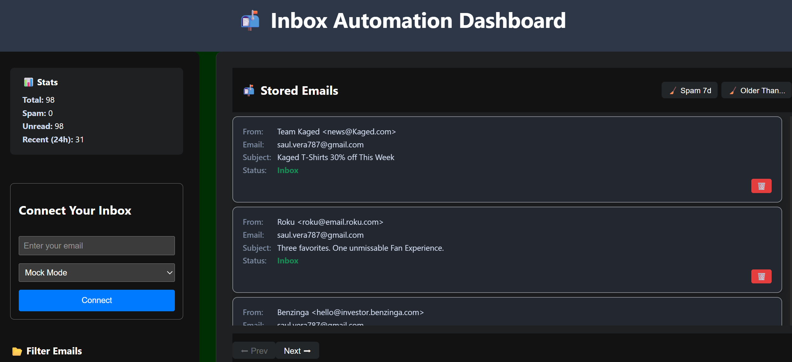

# 📬 Inbox Automation Dashboard (Frontend)

This React app powers the inbox automation dashboard, served via Nginx and integrated with the FastAPI backend.

---

## 🚀 Features

- Mobile-friendly dashboard UI
- Sidebar with live stats: total, spam, unread, recent
- Inbox/Spam toggle and search/filter controls
- Paginated email list with collapsible sections
- Animated buttons and card hover effects
- Accessible forms and keyboard navigation
- API integration via `/api/email/*` endpoints

---

## 🧭 Getting Started (Dev Mode)

```bash
npm install
npm start

```bash
## 🏗️ Production Build
npm run build

🐳 Docker Deployment
```bash
docker-compose up --build
http://<your-elastic-ip>:8000

🔗 API Integration

This app consumes the following backend endpoints:

GET /api/email/inbox?folder="[Gmail]/Spam" — fetch inbox or spam

GET /api/email/stats — show spam/read stats

GET /api/email/list — paginated, filterable email list

POST /api/email/filter — apply spam filter

🧠 Notes
Auth is currently simulated via dummy user context

IMAP credentials are stored locally per user (extendable)

For full functionality, ensure Gmail IMAP is enabled and folders are exposed

